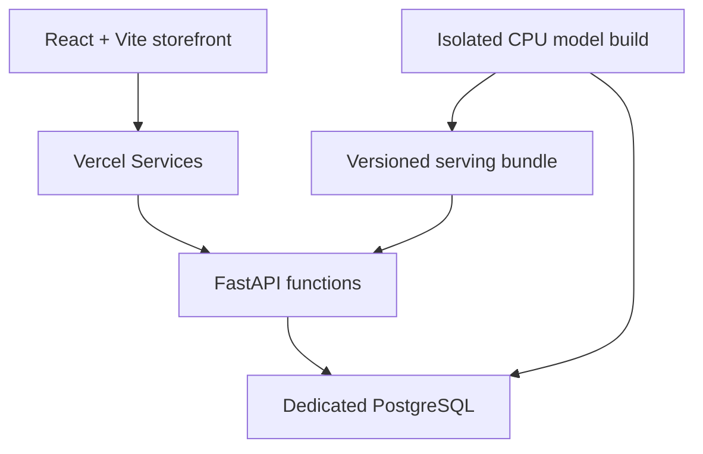

# SCENTHAUS Intelligence

[Live fragrance shop](https://scenthaus-intelligence.vercel.app/) · [Portfolio case study](https://teddy-qyuon-portfolio.vercel.app/projects/scenthaus-intelligence) · [Source repository](https://github.com/TeddyQyuon/scenthaus-intelligence) · [Deployment status](reports/deployment.md)

> The live shop contains all 35 requested fragrance houses, 150 product references and 297 size variants, with searchable brand navigation and quick bag actions. Preview and Production use separate Neon databases. Prices, stock and checkout are simulated. See [release evidence](reports/deployment.md).

SCENTHAUS Intelligence — a fragrance storefront built with React and Python, featuring personalized recommendations, demand forecasting and inventory analytics. Order history is simulated; reported results demonstrate the pipeline and methods, not real customer performance.

## Catalogue and commerce notice

The reference catalogue contains **150 real fragrances across 35 brands**, with product-specific photographs and links to manufacturer or retailer sources. Source links identify where each reference came from; they do not verify supplier authenticity or current availability.

Prices, stock, launch dates, users, browsing events and orders are simulated. Checkout creates a demo order and updates demo inventory; it never takes payment, sells, ships or fulfils a fragrance. Model results use generated behaviour, not real customer or commercial performance.

## Architecture



The browser uses one origin for the storefront and `/api`. PostgreSQL owns accounts, consent, saved items, simulated commerce and audit records. Vercel builds model artifacts from the consented dataset and packages them with the API deployment; API requests only run inference. Runtime recommendation inference uses cached NumPy arrays. Natural-language query embeddings use a pinned, quantized ONNX MiniLM encoder.

## Features

- Browse a searchable directory of all 35 fragrance houses. Brand links open the filtered collection directly, including on mobile.
- Browse and filter real fragrance references by brand, notes, size, budget, season and stock annotation in a beauty-retail storefront, with quick add-to-bag actions.
- Use hybrid recommendations, an accord-based quiz, similar-scent suggestions and natural-language search with example queries.
- Save a wishlist and bag to the account; place a simulated order without payment.
- Review demand forecasts, model comparisons, interval bands, inventory signals, model version and method notes in the protected admin area.
- Manage default-off personalization consent, export personal data and withdraw tracking consent.

## Evaluation on generated data

The training snapshot has **2,000 simulated users, 78 weeks of history, 150 catalogue products, 35 brands and 297 size variants**. The recommender uses 52/13/13-week chronological cutoffs and evaluates 1,058 users against novel purchases. Search labels are generated from catalogue rules and have not been human-reviewed.

| Recommender | Precision@10 | Recall@10 | NDCG@10 | Coverage | Brand diversity |
| --- | ---: | ---: | ---: | ---: | ---: |
| Popularity | 0.03195 | 0.18188 | 0.10609 | 0.15068 | 0.35624 |
| Item CF | 0.03781 | 0.21331 | 0.13731 | 0.97260 | 0.79026 |
| Content | 0.02420 | 0.13533 | 0.08460 | 0.28082 | 0.23913 |
| Hybrid | 0.03696 | 0.20821 | 0.13679 | 0.94521 | 0.81786 |
| Two-tower, full | 0.03743 | 0.21113 | 0.13405 | 0.60959 | 0.75208 |

Item CF has the highest NDCG among these rows. The two-tower BPR loss ablation scored 0.14087 in `ml/reports/recommender.md`; this single-seed diagnostic does not establish a consistent improvement. No result establishes real-market preference or commercial uplift.

| Search method | MRR@10 | NDCG@10 | Draft queries | Human-reviewed |
| --- | ---: | ---: | ---: | ---: |
| BM25 | 0.93889 | 0.93562 | 60 | 0 |
| Dense MiniLM | 0.92183 | 0.88918 | 60 | 0 |
| Hybrid reciprocal-rank fusion | 0.95278 | 0.93623 | 60 | 0 |

These labels test the search pipeline and overlap with catalogue text. They are not observed shopper relevance judgements.

| Forecast group | Model | WAPE | sMAPE | MASE | Interval coverage |
| --- | --- | ---: | ---: | ---: | ---: |
| SKU | LSTM, 3 seeds | 86.70% | 102.68% | 0.795 | 89.75% |
| Category | Seasonal naive | 14.75% | 21.55% | 0.933 | 27.08% |

Forecast scores average three expanding test origins and the first four weeks at each origin. Category interval coverage is poor in this run. LSTM and N-BEATS use learned P10/P50/P90 outputs; baseline bands use validation residuals. These are evaluation results on generated weekly demand, not live sales or calibrated stock guarantees. Full tables and protocols are in [`ml/reports/`](ml/reports/) and the [model cards](docs/model-cards.md).

## Run locally without Docker

Prerequisites: Python 3.12, Node.js 22+, and a running native PostgreSQL database. Use a **new empty development database**; the seed command deliberately does not overwrite an existing catalogue. Copy `backend/.env.example` to `backend/.env`, set `DATABASE_URL`, and choose a unique `ADMIN_PASSWORD` before seeding.

1. Install the Python and frontend dependencies:

   ```bash
   python3.12 -m venv .venv && source .venv/bin/activate && \
     python -m pip install torch==2.9.0 --index-url https://download.pytorch.org/whl/cpu && \
     python -m pip install -r backend/requirements-training.txt && \
     (cd frontend && npm ci)
   ```

2. Migrate the empty database, generate the simulated dataset and train the serving models:

   ```bash
   cd backend && PYTHONPATH=..:. ../.venv/bin/alembic upgrade head && \
     PYTHONPATH=..:. ../.venv/bin/python -m app.seed && \
     PYTHONPATH=..:. ../.venv/bin/python -m ml.train_all
   ```

3. From the repository root, start the API, storefront and local MLflow process:

   ```bash
   source .venv/bin/activate && python scripts/dev.py
   ```

Storefront: `http://localhost:5173` · API: `http://localhost:8000` · MLflow: `http://localhost:5000`.

## Vercel deployment

Deploy from the repository root. `vercel.json` routes `/api/*` to FastAPI and storefront paths to the React SPA. The API build uses a temporary training environment with CPU PyTorch, migrates a dedicated database, seeds only an empty catalogue, trains the versioned bundle and downloads the pinned ONNX query encoder. Generated model weights are not committed to Git. The deployed function uses the smaller runtime dependency set and does not train on requests.

Set these Vercel environment variables for the relevant environment:

| Variable | Purpose |
| --- | --- |
| `DATABASE_URL` | Pooled TLS PostgreSQL URL for API requests. |
| `DATABASE_URL_UNPOOLED` | Direct PostgreSQL URL for the build-time advisory lock. |
| `ENVIRONMENT` | Set to `production`. |
| `SECRET_KEY` | Unique random secret, at least 32 characters. |
| `ADMIN_EMAIL` / `ADMIN_PASSWORD` | Initial administrator created by the empty-database seed. |
| `CRON_SECRET` | Bearer secret for daily maintenance. |
| `ALLOWED_ORIGINS` | Exact HTTPS storefront origin. |

Use a separate empty database for Preview and Production; never expose production database credentials to branch previews. The build checks that the catalogue matches this 150-product release and stops if it finds an older or mixed catalogue. It preserves existing records and explains when a clean database is required. See [deployment steps and current hosting evidence](docs/deployment.md).

## Privacy and model limits

Personalization is off until a shopper opts in. Without consent, quiz answers are used for that request only and are not saved. Consent withdrawal deletes tracked events, quiz profile and recommendation references; wishlist, bag and demo orders remain available for account functionality. Training reads only consented pseudonymous interactions. Previously trained aggregate contributions are removed when the next model build uses the updated consented dataset.

The system is a portfolio demonstration, not a real fragrance retailer. It does not verify stock or authenticity, assess product suitability, process real payments, or make purchase and replenishment decisions without human review. See [governance notes](docs/governance.md) and [deployment evidence](reports/deployment.md).

## Checks

Native CI passed all 65 Python tests with zero skips and Ruff after actual model training. The [verified frontend run](https://github.com/TeddyQyuon/scenthaus-intelligence/actions/runs/37413048770) passed all three Playwright journeys, the production build and the API/Vite/MLflow launcher health checks from a fresh checkout. It verifies unchanged backend/training code and matching model checksums before reusing the native training artifact. Local browser tests can be run with `cd frontend && npx playwright install chromium && npm test` after training and starting the API. Source revisions, model provenance and detailed scope are in [verification](reports/verification.md).

## Project documents

- [Model cards](docs/model-cards.md)
- [Architecture](docs/architecture.md)
- [Human involvement and risk](docs/governance.md)
- [Feature matrix](docs/feature-matrix.md)
- [Portfolio entry](docs/portfolio-entry.md)
- [Vercel deployment](docs/deployment.md)

Storefront update (2026-10-07): public pages render while the guest session connects. Product listings do not wait for recommendations. Quick add lets shoppers choose an available bottle size with its simulated SGD price, then view their bag or continue browsing. The mobile header exposes collection search, and the homepage hero uses an optimized WebP asset. Session and size-picker regressions are in `frontend/e2e/storefront.spec.js`.

The release also preserves the deployed account-security extension: authenticator-based two-factor sign-in, single-use recovery codes, password changes, device sessions, revocation and a 90-day security history. Bag additions use a serialized server-side increment so concurrent additions do not overwrite existing quantities. Quick add checks current availability and lets shoppers choose both bottle size and quantity.
