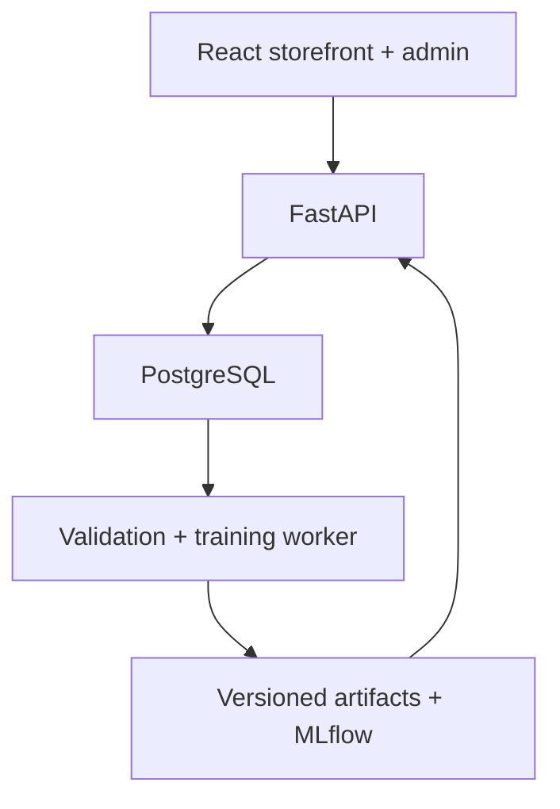

# Architecture

React + Vite serves a JavaScript storefront. The `/api` reverse proxy forwards requests to FastAPI, preserving a same-origin browser session. Python owns catalogue access, authentication, cart/wishlist/quiz state, transactional demo orders, consented events and administration. PostgreSQL stores all durable commerce and tracking records. Browser localStorage is not used for these features.

Products hold note pyramids, accords and contextual labels. Variants hold size, price, stock and lead time. Users have optional credentials and default-off consent. Session tokens are stored as SHA-256 hashes, while cookies hold high-entropy opaque raw tokens. No email or password is included in model features.

The generator has 2,000 latent Dirichlet tastes, budget variation and loyalty noise. A weekly trend, sinusoidal product drift, calendar/promo multipliers and companion purchases yield 104 weeks of repeatable but artificial orders. Hidden vectors are not persisted as training features. Historical purchases do not decrement the present-day illustrative inventory snapshot.

Training excludes nonconsenting users, checks nulls/duplicates/foreign keys/price and quantity validity/launch timing, and records an order-line fingerprint. Temporal cutoffs bound purchases, wishlist and event signals. Product vocabulary/SVD fitting uses items launched before each cutoff. Hybrid weights are chosen on validation. Forecast features are constructed from preceding lags and recursive predictions, never future actuals.

A complete trusted pickle bundle and metrics JSON are written into a new version folder. MLflow records metrics, parameters and metrics artifacts. Database model/snapshot records commit before a temporary manifest atomically replaces `current.json`. Serving checks path syntax and SHA-256 before loading locally trained pickle; user-uploaded models are never accepted. A failed training run leaves the active manifest unchanged.

Static item similarities use a bounded LRU. Personal state and product eligibility are read live and are not shared in a personalized cache. Recommendation IDs tie impressions/clicks to the same user, allowed items and model within seven days. Last valid recommendation click gets one revenue credit per purchased line. Historical simulated browsing intentionally has no attribution IDs; placement performance starts from actual demo interactions.

The worker reconciles completed weekly ForecastSnapshots with actual sales and expires events/recommendation references after 180 days. RFM clusters are aggregated in the admin and are not consequential classifications of customers. Monitoring is process-local latency/error sampling plus a PSI heuristic; this is not distributed observability.

Vercel Services hosts React and FastAPI on one origin; backend/main.py mounts /api because Services preserves the original path. A build-time advisory lock protects migration and idempotent initialization of the dedicated managed PostgreSQL database. Requests read the committed checksum-verified model and never train or write artifacts. Daily bearer-authenticated Vercel Cron reconciles outcomes and applies retention. Separate opt-in GitHub Actions training commits new model versions, which trigger deployment through the Git integration.

Compose remains an optional local development topology with shared model/MLflow volumes. It is not used for the requested Vercel hosting.
