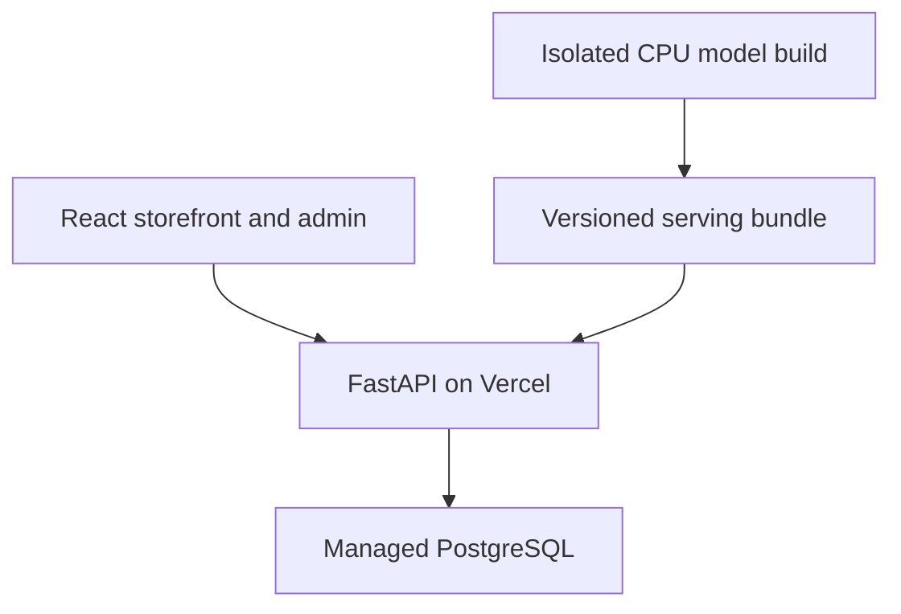

# Architecture

SCENTHAUS is a React/Vite storefront, a FastAPI service and a separate offline model-build path. Vercel Services routes the storefront and `/api` on one origin. PostgreSQL stores accounts, consent, saved items, historical simulations, Stripe order state and tracking data.

## Request path

- React calls the same-origin `/api` routes. The API service mounts FastAPI under `/api` and enforces session, role, CSRF/Origin, ownership and consent checks server-side.
- PostgreSQL holds the 150-product fragrance reference catalogue, 297 size variants, accounts, wishlists, carts, historical demo orders, immutable payment snapshots and consented events. Product references and images are real; prices, stock and behaviour are simulated.
- Recommendations serve cached NumPy arrays. Search uses BM25 plus precomputed dense product vectors and a quantized ONNX MiniLM query encoder. The Vercel request path does not train models.
- Serving artifacts are built from a trusted, versioned bundle and checksum-verified before loading. The function bundles only the small inference modules, YAML configs, encoder assets and serving artifacts it needs.

## Training and evaluation

The seed command creates a fixed, synthetic activity and order history. The training pipeline filters user-derived records to consented users, validates catalogue/order integrity, and uses time-based splits. Recommender, search and forecasting results are reported with baselines in [`ml/reports/`](../ml/reports/). The full forecasting and recommendation artifacts are assembled at build time for a new Vercel release; training weights are not committed to Git.

Model changes are versioned, and a failed build does not replace a previously active artifact pointer. Product, stock and account state remain live in PostgreSQL; personal state is not stored in a shared recommendation cache.

## Privacy and operations

Personalization is off by default. Without consent, a quiz is used for that response only; browsing events are not accepted for tracking. Withdrawal removes the user's events, quiz profile and recommendation references, and future training excludes their orders and other activity. Wishlist, cart and orders remain available as functional account features. See [`governance.md`](governance.md).

Vercel Cron calls the authenticated maintenance route for retention and completed-week reconciliation. No automatic model retraining is enabled. A future build can regenerate a model bundle after an owner-reviewed deployment; it must point at a dedicated clean database for the 150-product release.

## Development

Local development uses native PostgreSQL, the same React/API services and optional local MLflow. Docker is not part of the requested run path. Setup commands are in the [README](../README.md).

## Stripe checkout

The API validates the database bag and official SGD prices, reserves inventory atomically, and creates Stripe-hosted Checkout using a stable order idempotency key. Signed webhook events confirm the existing order; success-page navigation cannot confirm payment. Pending/failed orders are excluded from purchase analytics. Card information stays on Stripe. Test mode is currently configured; see [checkout operations](stripe-checkout.md) for credentials, webhook events, reconciliation and merchant launch limits.
